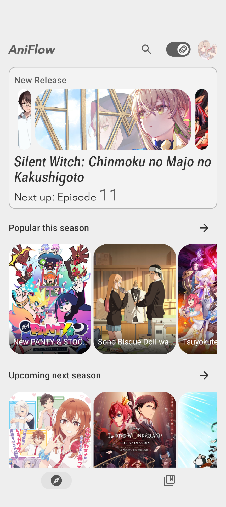
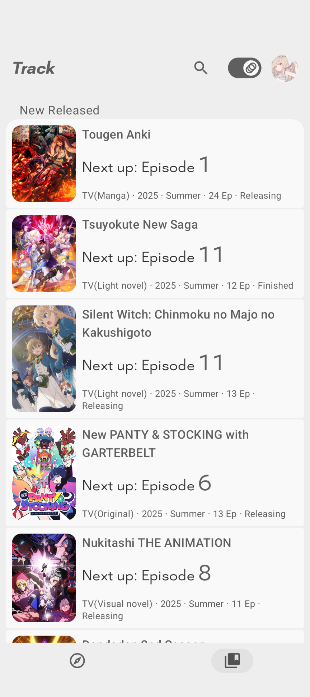
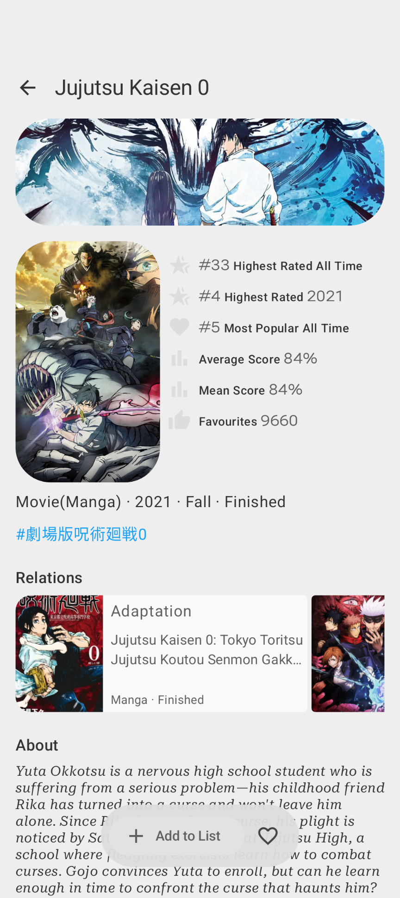
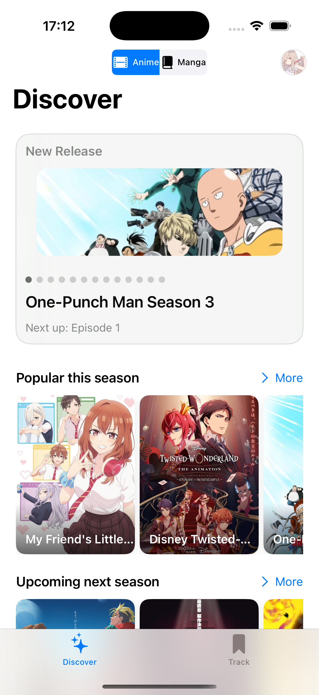
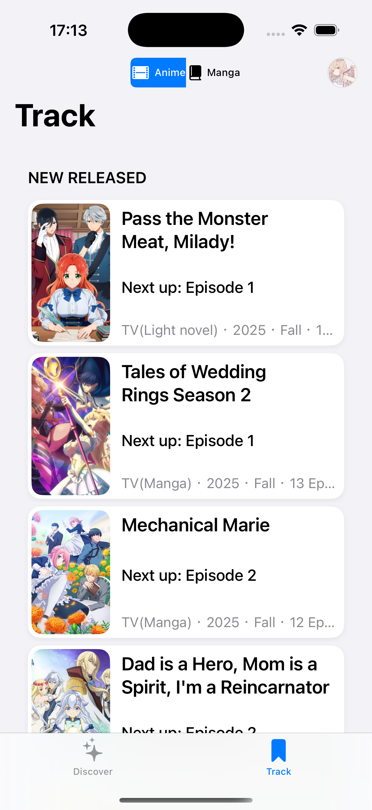
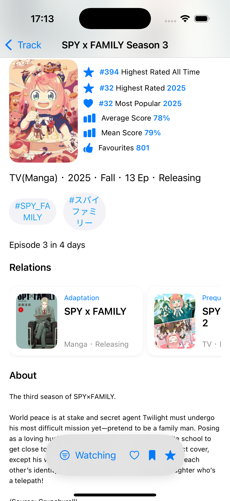

# AniFlow

An unofficial client for [AniList](https://anilist.co/home).

AniFlow is a Kotlin Multiplatform (KMP) app for browsing anime, viewing details (staff, characters, rankings), and managing your list with scoring.

## Screenshots

### Android

  
  
  

### iOS screenshots

  
  
  

## Architecture
AniFlow follows a Kotlin Multiplatform + Native UI approach:
 - Data Layer (Shared with Kotlin Multiplatform)
   - Networking (Ktor)
   - Persistence (SqlDelight, DataStore)
 - UI Layer
   - Android: Jetpack Compose (Material3 Expressive design + navigation3 + ViewModel)
   - iOS: SwiftUI

Compose Multiplatform components are kept minimal for cross-platform utilities, but platform-native UI is the primary choice for user experience.

## Code style

This project uses [ktlint](https://github.com/pinterest/ktlint).`

running `./gradlew ktLintFormat` to automatically fix lint errors.

running `./gradlew spotlessApply` to add copyright.
